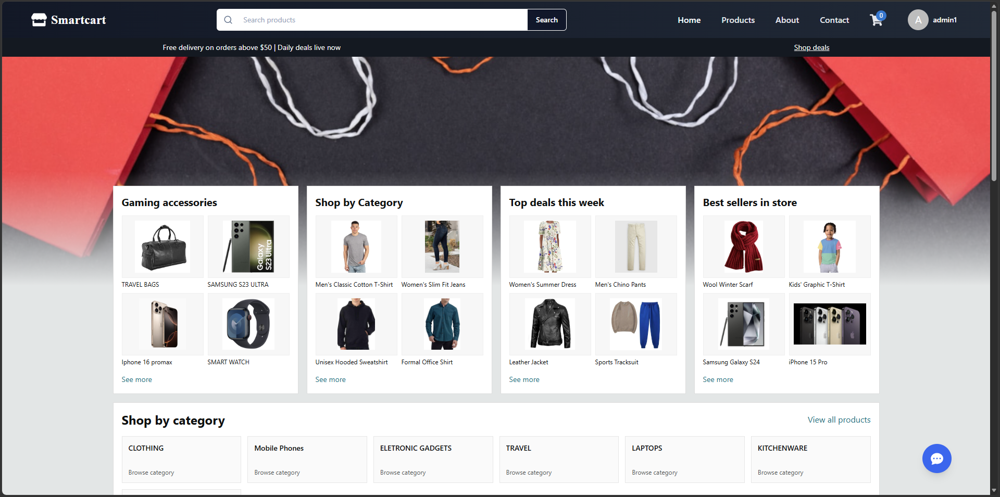

# Smartcart Ecommerce Frontend



This repository contains the frontend application for Smartcart, a full-stack e-commerce platform built with React and Vite. The storefront includes product browsing with search and filtering, a complete cart and multi-step checkout flow with Stripe payment integration, and an AI-powered shopping assistant driven by LangChain4j on the backend. The application also provides role-based admin and seller dashboards for managing products, orders, categories, and sellers.

Live Demo: [smartcart.munashemudabura.com](https://smartcart.munashemudabura.com/)

---

## Features

- Responsive storefront with product browsing, search, and category filtering
- AI-powered shopping assistant providing personalized product recommendations
- Shopping cart with quantity management and real-time price calculations
- Multi-step checkout flow with address management, payment method selection, and order review
- Stripe payment gateway integration with invoice generation
- User authentication with login and registration
- Role-based access control for admin and seller dashboards
- Product, order, category, and seller management interfaces

---

## Technologies Used

- [React 19](https://react.dev/) with [Vite 7](https://vitejs.dev/)
- [Tailwind CSS v4](https://tailwindcss.com/)
- [Redux Toolkit](https://redux-toolkit.js.org/) for state management
- [React Router 7](https://reactrouter.com/) for client-side routing
- [Material UI](https://mui.com/) and [Headless UI](https://headlessui.com/)
- [Stripe React SDK](https://stripe.com/docs/stripe-js/react) for payment processing
- [Axios](https://axios-http.com/) for API communication
- Docker and Nginx for containerized deployment

---

## Screenshots

### Home Page


### AI Shopping Assistant


### Product Search


### Shopping Cart


### Checkout - Address Selection


### Checkout - Payment Method


### Checkout - Order Summary


### Stripe Payment Gateway


### Order Confirmation


---

## Installation and Setup

To run the project locally:

```bash
# 1. Clone the repository
git clone https://github.com/mudabs/Ecommerce-Frontend.git

# 2. Navigate to the project directory
cd Ecommerce-Frontend

# 3. Install dependencies
npm install

# 4. Create a .env file with the required environment variables
# 5. Start the development server
npm run dev
```

### Environment Variables

Create a `.env` file in the project root:

```env
VITE_BACK_END_URL=http://localhost:5000
VITE_BACK_END_API_PREFIX=/api
VITE_API_AUTH_BASE_URL=http://localhost:5000/api/auth
VITE_API_PUBLIC_BASE_URL=http://localhost:5000/api/public
VITE_FRONTEND_URL=http://localhost:5173
VITE_STRIPE_PUBLISHABLE_KEY=your_stripe_publishable_key
VITE_SKIP_BACKEND_IMAGES=false
```

## Docker

To build and run the application in a container:

```bash
docker compose up --build
```

Then open `http://localhost:8080`.

Container details:

- Service name: `frontend`
- Container name: `ecommerce-frontend`
- Exposed host port: `8080`
- Served by Nginx on container port `80`
